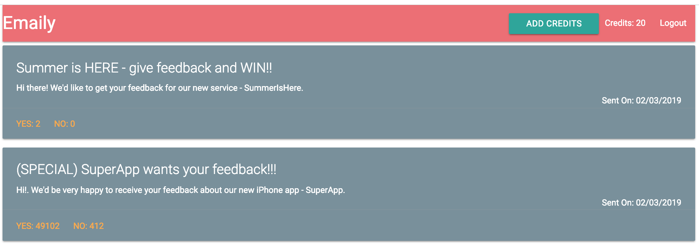
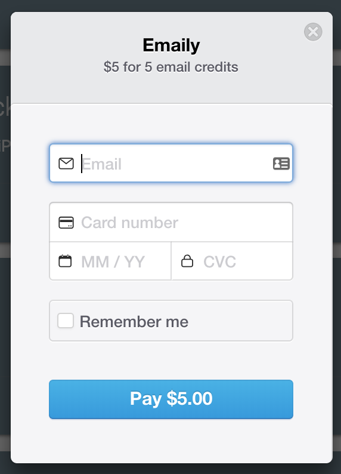
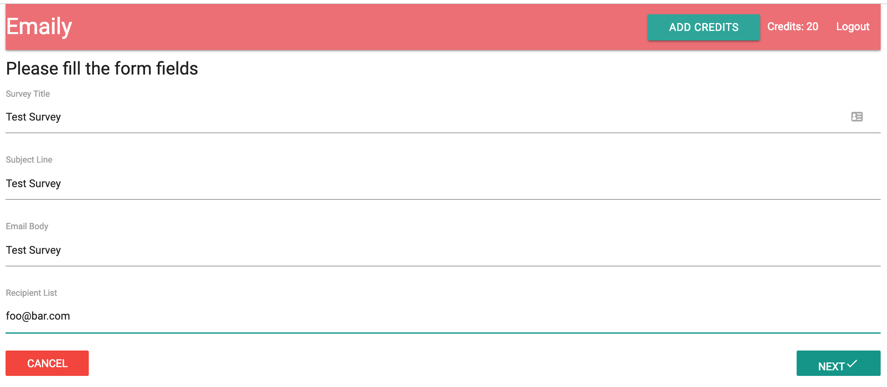
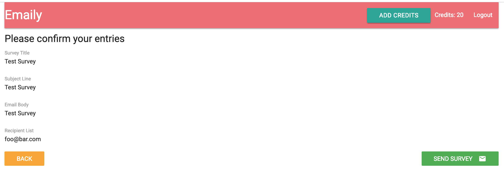

# Node With React Full Stack Web Development

## WHAT

This is a study project for Udemy FullStackReactCode course by [Stephen Grider](https://www.udemy.com/user/sgslo/).

* Course page in Udemy: https://www.udemy.com/node-with-react-fullstack-web-development/learn/v4/overview
* Course code in GitHub: https://github.com/StephenGrider/FullstackReactCode

### Course project target

* Build a fullstack app (a service for requesting feedback from users).
* Learn technologies and techniques to build end-to-end Node.js + MongoDB + React service with OAuth authentication, Stripe integration for payments, SendGrid integration for email handling.

### Technologies used in the course

* Frontend: React, Redux
* Backend: Express (nodejs), PassportJS, MongoDB
* Authentication: Google OAuth
* Payments: Stripe
* Email handling: SendGrid

## Prerequisites

* [Google Developer credentials](https://console.developers.google.com) (used for Google OAuth)
* [MLab account](https://mlab.com/) (used for MongoDB)
* [Stripe account](https://stripe.com/) (used for payment functionality)
* [SendGrid account](https://sendgrid.com/) (used for email sending and callbacks)
* [Node.js](https://nodejs.org/) installed locally for development

NOTE: After creating accounts, you need to edit 3 config files:

* Rename ./config/dev_template to **./config/dev.js**
* Edit the **dev.js** file to add all necessary credentials to access the related services.
* Edit Stripe's client side keys to ./client/.env.development and ./client/.env.production

## HOW TO run the service

To prepare the service do the following:

* Go to **udemy-emaily** folder
* Run `npm install` on command line to install server side dependencies
* Go to **client** folder
* Run `npm install` on command line to install client side dependencies

To run the service do the following:

* Go to **udemy-emaily** folder
* Run `npm run dev` on command line to start the service
* NOTE: Service opens browser to http://localhost:3000

## Emaily service UI

See below some pictures from Emaily UI.

* Emaily Main view - list of surveys:
  

* Emaily Add credits - Stripe dialog to add more credits:
  

* Emaily Add survey - a new survey form:
  

* Emaily Review survey - review survey content before sending:
  
